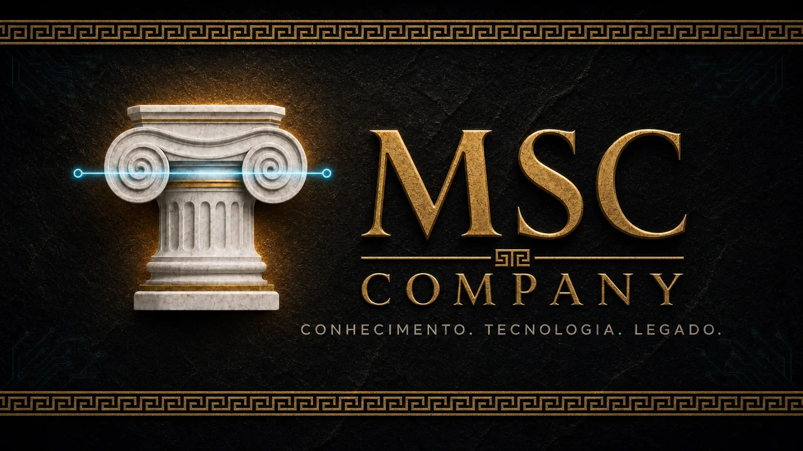

# MSC Company

**Holding de tecnologia, educação e produtos digitais — Rio de Janeiro 🇧🇷**

[Site](https://msc-website.vercel.app) · [Hugging Face](https://huggingface.co/MSC-Company) · [Fundador](https://github.com/Finish-Him)

---

## Quem somos

A **MSC Company** consolida marcas de educação, IA aplicada, alimentação e mídia sob uma única estrutura: infraestrutura, conhecimento e inteligência artificial compartilhados, com cada marca operando de forma autônoma.

## Marcas

| Marca | O que é | Status |
|---|---|---|
| 🎓 **MSC Academy** | Plataforma educacional com tutores de IA (Arquimedes, Artemísia) para concursos e OAB | 🟢 Em produção |
| 🧪 **MSC Labs** | Laboratório de IA — developer console, fine-tuning e agentes | 🟡 MVP |
| 🍧 **Recanto do Açaí** | Delivery e eventos (Recanto de Estações) — Guadalupe, RJ | 🔄 Relançamento em preparação |
| ⚽ **Sporting Vila** | Mídia esportiva (Sporting TV) | 🏗️ Em estruturação |
| 🏦 **G&M Bank** | Fintech | 💡 Conceito |
| 💼 **MSC Consultoria** | Serviços B2B de tecnologia e gestão (ex.: DETRAN-RJ) | 🟢 Ativa |

## Repositórios principais

| Repositório | Descrição |
|---|---|
| [`Academy`](https://github.com/Msc-Company-Org/Academy) | Plataforma MSC Academy — Next.js + tRPC + TiDB |
| [`msc-platform`](https://github.com/Msc-Company-Org/msc-platform) | Monorepo institucional — site, blog, portfólio e design system |
| [`msc-labs`](https://github.com/Msc-Company-Org/msc-labs) | Developer console e orquestração de modelos |
| [`recanto-eventos`](https://github.com/Msc-Company-Org/recanto-eventos) | Site e funil comercial do Recanto de Estações |
| [`harness-msc`](https://github.com/Msc-Company-Org/harness-msc) | Orquestrador de agentes de IA do ecossistema |

## Plataformas

- **GitHub** — código, governança e CI
- **Vercel** — sites e frontends em produção
- **Hugging Face** — modelos, datasets e demos em [`MSC-Company`](https://huggingface.co/MSC-Company)

## Convenções

| Item | Padrão |
|---|---|
| Branch principal | `main` |
| Commits | Conventional Commits |
| Stack web | React 19 · TypeScript · Tailwind 4 · tRPC · Drizzle |
| Privado vs. público | Dados e operações internas privados; demos e perfil públicos |

---

  <b>Kaizen</b> — melhoria contínua, um commit de cada vez · Rio de Janeiro, Brasil

